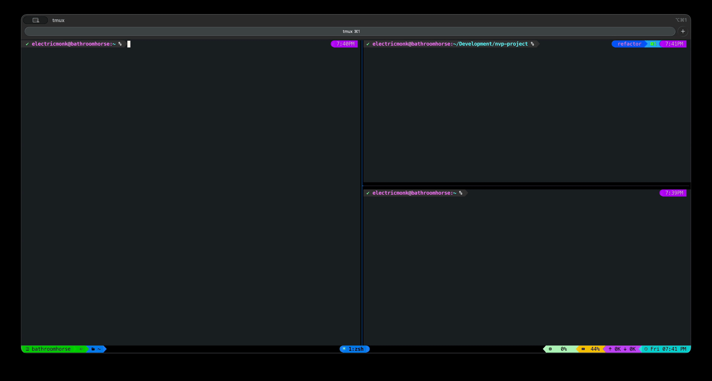

# nvp (Neovim Panes)

`nvp` is a smart wrapper for Neovim designed specifically for **Tmux** power
users. It eliminates the friction of managing Neovim sockets and terminal
panes, ensuring your editor always opens exactly where you want it.

## Why nvp instead of nvr?

While `nvr` is excellent for basic remote control, `nvp` is built specifically
for the Tmux environment:

- **Pane Awareness:** Unlike `nvr`, which just sends files to a socket, `nvp`
  actively manages your Tmux layout. It ensures focus shifts to the correct
  pane so you actually see what you're editing.

- **Smart Splitting:** If your target editor pane is busy (e.g., running a
  server or a 3D print monitor), `nvp` won't just fail or send keys into a
  void; it will split the pane and launch a new instance.

- **Zero Configuration Sockets:** `nvp` automatically handles socket naming
  based on your Tmux session and window. You don't have to manually manage
  `NVIM_LISTEN_ADDRESS` variables.


## The Workflow

- **One Editor, Many Panes:** Launch `nvp` from any pane; it automatically
  finds (or creates) your editor in a designated target pane.

- **Instant RPC:** If Neovim is already open, `nvp` talks to the existing
  instance via RPC to open files instantly.

- **System Integration:** Built-in support for "blocking" edits like `git
  commit`, `visudo`, or Zsh's `edit-command-line`.


## Simple Demo




## Installation

You can install `nvp` directly from GitHub using `pip`:

```sh
pip install git+https://github.com/balthisar/nvp-project.git
```


## Command Line Interface

```
usage: nvp [-h] [-v] [-p PANE] [-s {v,h}] [-l] [-b] [files ...]

nvp v1.1: A spatial Neovim manager for Tmux.

positional arguments:
  files              Files to open

options:
  -h, --help         show this help message and exit
  -v, --version      show program's version number and exit
  -p, --pane PANE    Override target tmux pane index
  -s, --split {v,h}  Override split direction
  -l, --list         List all active nvp sockets
  -b, --buffers      List open buffers and tabs for each socket (implies --list)
```

## Contributions

Contributions via PR's are welcome!

